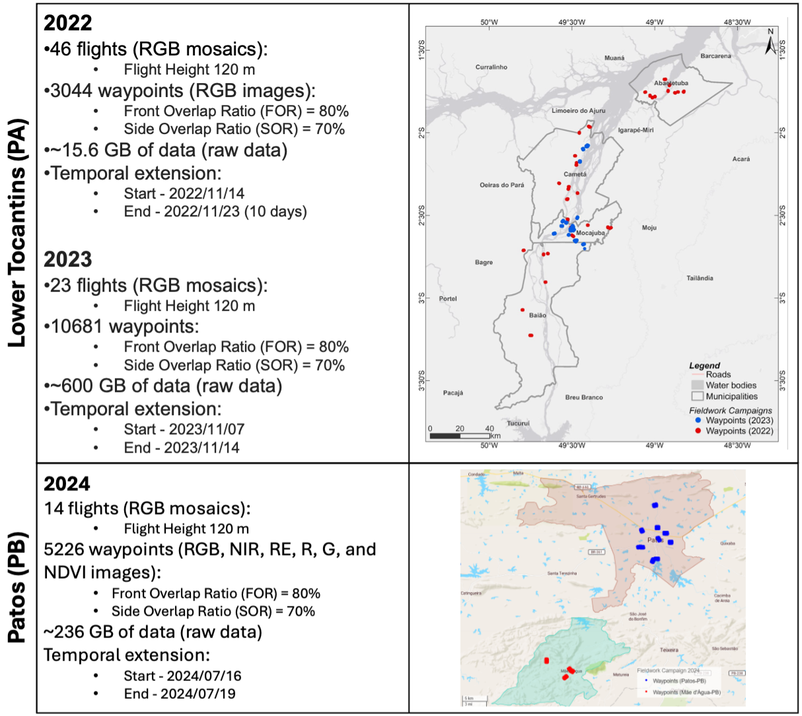

Collection 1 (DEPRECATED)
=========================

Drone
-----

The drone dataset comprises information from XX flights carried out in the Lower Tocantins (PA) region and Patos (PB) during Harmonize team field campaigns in 2022, 2023 and 2024. 
This collection encompasses all images, mosaics, and NDVI products generated during the fieldworks obtained from MAVIC and Phanton. Figure 1 illustrates the details and distribution 
of the flights recorded throughout these campaign. 

   **Figure 1 – Harmonize Project hotspots.**

.. note::

   See the documentation and drone image collections access using STAC.

   - `Python notebook <https://github.com/Harmonize-Brazil/code-gallery/blob/main/jupyter/Python/drone/drone_image_collections_using_stac.ipynb>`_

Health data
-----------

The health data from Data Collection 2 focus on two key regions for the HARMONIZE Project in Brazil: the north (Lower Tocantins) 
and the northeast (Semiarid Paraíba). These health data are derived from Fiocruz's Health Information Laboratory (LIS) and the InfoDengue initiative. 
Both efforts generate health indicators that account for the impacts of environmental and climate change on the Brazilian population.
The indicators selected for the Data Collection 2 (see table 1) emphasize vector-borne diseases relevant to the Harmonize Project’s e 
covers the last decade. 

.. raw:: html
    
Table 1 – Health indicators available from Data Collection 2.

    <table border="1" style="border-collapse: collapse; width: 100%; font-size: 12px; vertical-align: middle;">
      <thead>
        <tr>
          <th><b>Indicator</b></th>
          <th><b>Spatial aggregation</b></th>
          <th><b>Temporal aggregation</b></th>
          <th><b>Period</b></th>
          <th><b>Data source</b></th>
        </tr>
      </thead>
      <tbody>
        <tr>
          <td>Dengue mortality rate per 100.000 inhabitants</td>
          <td>Municipality</td>
          <td>Epidemiological week, month and year</td>
          <td>Jan 2010 - Dec 2010</td>
          <td>LIS - ICICT/Fiocruz</td>
        </tr>
        <tr>
          <td>Dengue confirmed cases</td>
          <td rowspan="4">Municipality</td>
          <td rowspan="4">Epidemiological week, month and year</td>
          <td rowspan="4">Jan 2010 - Dec 2021</td>
          <td rowspan="4">LIS - ICICT/Fiocruz</td>
        </tr>
        <tr>
          <td>Chikungunya confirmed cases</td>
        </tr>
        <tr>
          <td>Zika confirmed cases</td>
        </tr>
        <tr>
          <td>Chagas disease cases</td>
        </tr>
        <tr>
          <td>Number of Dengue cases reported</td>
          <td rowspan="11">Municipality</td>
          <td rowspan="11">Epidemiological week</td>
          <td rowspan="11">Jan 2010 - Dec 2024</td>
          <td rowspan="11">Mosqlimate - <a href="https://info.dengue.mat.br">InfoDengue</a></td>
        </tr>
        <tr>
          <td>Number of Chikungunya cases reported</td>
        </tr>
        <tr>
          <td>Number of Zika cases reported</td>
        </tr>
        <tr>
          <td>Estimated Dengue incidence rate (cases per population x 100.00)</td>
        </tr>
        <tr>
          <td>Estimated Chikungunya incidence rate (cases per population x 100.00)</td>
        </tr>
        <tr>
          <td>Estimated Zika incidence rate (cases per population x 100.00)</td>
        </tr>
        <tr>
          <td>Dengue alert level</td>
        </tr>
        <tr>
          <td>Chikungunya alert level</td>
        </tr>
        <tr>
          <td>Zika alert level</td>
        </tr>
      </tbody>
    </table>

.. note::

   See the documentation about health data processing

   - `Python notebook <https://github.com/Harmonize-Brazil/code-gallery/blob/main/jupyter/Python/ehipr/spatializing_lis_indicator.ipynb>`_
   

Climate data
------------

The climate data from Data Collection 2 also target two key regions within the HARMONIZE Project in Brazil: the north (Lower Tocantins) 
and the northeast (Semiarid Paraíba). Climate data were produced considering products produced by Fiocruz team (ref) from the Copernicus Climate Change Service (C3S), which 
the European Centre implements for Medium-Range Weather Forecasts (ECMWF) ERA5-Land reanalysis dataset and available by the Center for 
Weather Forecasting and Climate Studies (CPTEC/INPE): SAMeT and MERGE. The collection covers the period from January 2019 to October 2024. 
Table 2 lists the climate indicators for the second collection. 

.. raw:: html
    

        Table 2 – List of climate indicators
    

    <table border="1" style="border-collapse: collapse; width: 100%; font-size: 12px; text-align: center; vertical-align: middle;">
      <thead>
        <tr>
          <th><b>Indicator</b></th>
          <th><b>Spatial aggregation</b></th>
          <th><b>Temporal aggregation</b></th>
          <th><b>Period</b></th>
          <th><b>Data source</b></th>
        </tr>
      </thead>
      <tbody>
        <tr>
          <td>Maximum, mean and minimum temperature (°C)</td>
          <td>Municipality</td>
          <td>Epidemiological week and month</td>
          <td>Jan 2019 - Dec 2023</td>
          <td>ERA5-Land (Saldanha - indicator 2m temperature)</td>
        </tr>
        <tr>
          <td>Maximum, mean and minimum precipitation (mm)</td>
          <td>Municipality</td>
          <td>Epidemiological week and month</td>
          <td>Jan 2019 - Dec 2023</td>
          <td>ERA5-Land (Saldanha - indicator 2m temperature)</td>
        </tr>
        <tr>
          <td>Relative humidity (%)</td>
          <td>Municipality</td>
          <td>Epidemiological week and month</td>
          <td>Jan 2019 - Dec 2023</td>
          <td>ERA5-Land (Saldanha - indicator <i>2m temperature</i> and <i>2m dewpoint temperature</i>)</td>
        </tr>
        <tr>
          <td>Maximum temperature anomaly (in number of consecutive days)</td>
          <td>Municipality</td>
          <td>Epidemiological week and month</td>
          <td>Jan 2019 - Dec 2023</td>
          <td>Maximum Temperature of the Climatological Normal (INMET1) and <b>ERA5-Land</b> (Raphael Saldanha - indicator 2m temperature)</td>
        </tr>
        <tr>
          <td>Maximum, mean and minimum temperature (°C)</td>
          <td>Municipality</td>
          <td>Epidemiological week and month</td>
          <td>Oct 2018 - Oct 2024</td>
          <td>SAMeT - CPTEC/INPE</td>
        </tr>
        <tr>
          <td>Maximum, mean and minimum precipitation (mm)</td>
          <td>Municipality</td>
          <td>Epidemiological week and month</td>
          <td>Oct 2018 - Oct 2024</td>
          <td>MERGE - CPTEC/INPE</td>
        </tr>
      </tbody>
    </table>

.. note::

   See the documentation about climate data processing

   - `R script <https://github.com/Harmonize-Brazil/code-gallery/blob/main/jupyter/R/rclimpr/climate_indicator.ipynb>`_