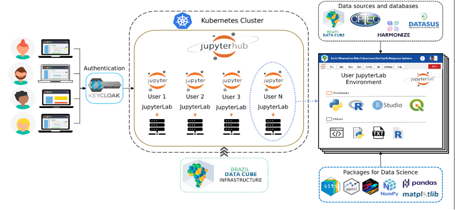

Geospatial Data Science Environment (BDC Lab)
=============================================
The Geospatial Data Science Environment (BDC-Lab) is designed to provide integrated geospatial data analysis tools connected directly to BDC data 
(Figure 1). This approach eliminates the need to download large volumes of Earth Observation data, enabling researchers to conduct advanced analyses
using RStudio, QGIS, Metview, VSCode, and Jupyter Notebooks, all equipped with a range of R and Python geospatial libraries. Currently, it is in an
experimental phase, where some users are testing its functionalities and providing feedback for its improvement. Please contact us to request access
to the BDC Lab environment.

   **Figure 1 – Simplified BDC-Lab workflow.**

https://github.com/Harmonize-Brazil/Harmonize-Explorer

Geospatial Data Science Environment (BDC Lab)
=============================================
The Geospatial Data Science Environment (BDC-Lab) is designed to provide integrated geospatial data analysis tools connected directly to BDC data (Figure 1). This approach eliminates the need to download large volumes of Earth Observation data, enabling researchers to conduct advanced analyses using RStudio, QGIS, Metview, VSCode, and Jupyter Notebooks, all equipped with a range of R and Python geospatial libraries. Currently, it is in an experimental phase, where some users are testing its functionalities and providing feedback for its improvement. 

This tutorial demonstrates how to use these tools to access and manipulate HARMONIZE Instance ALPHA R components, perform queries, and visualize results, showcasing the technologies developed by the team over the past two years. Additionally, the tutorial's code (Jupyter notebooks) can be downloaded and execute

This tutorial is organized into four parts, presented through Jupyter notebooks that combine text, code, and visualizations. The first part introduces the BDCLab platform, explaining how to access it and providing an overview of its key features. The next two parts focus on the tools developed  for preparing each of the Harmonize Project’s data types - health and climate data as well as drone imagery - and demonstrate how to use the Harmonize STAC to access and visualize Data Collection 2. Finally, the fourth part will present a fully integrated visualization that brings all these data together for a specific area in Mocajuba (Pará, Lower Tocantins).

A set of tutorials, linked bellow, demonstrates how to use these tools to access and manipulate HARMONIZE Instance ALPHA R data (climate, health and drone data), 
perform queries, and visualize results, showcasing the technologies developed by the Harmonize team over the past two years. Additionally, the tutorial's code 
(Jupyter notebooks) can be downloaded and executed locally or in clou-based environments such as Google Colab or JupyterHub.

1. Tutorials 

- Geting data:
- Processin data:

.. tip::

   **About BDC Lab**

   See about the Documentation and courese to the use BDC Lab.

   - `XXXXXX <https://github.com/Harmonize-Brazil/code-gallery/blob/main/jupyter/R/rclimpr/climate_indicator.ipynb>`_

